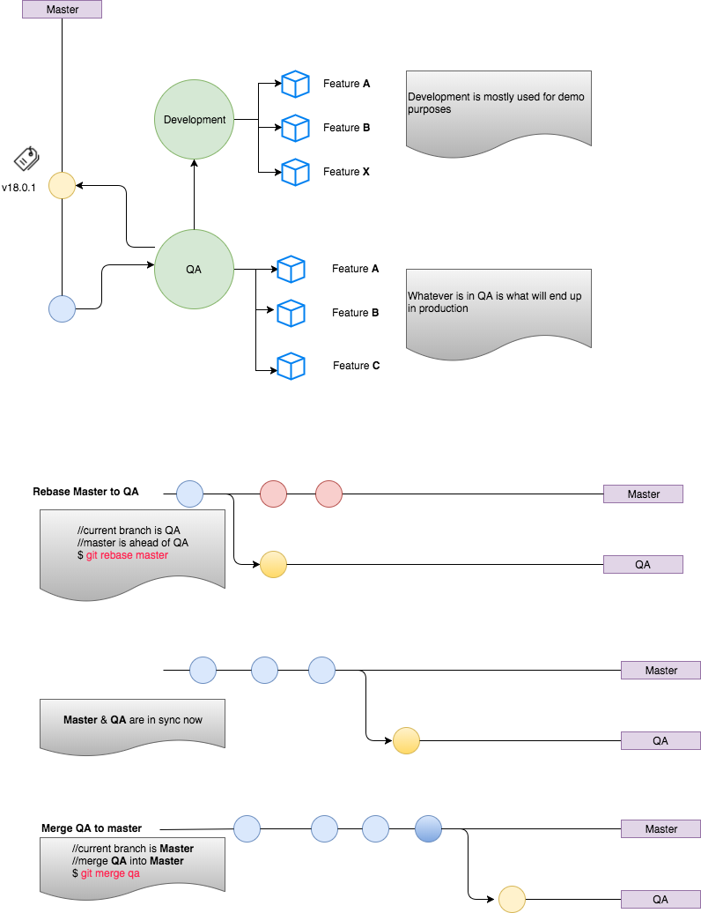

# Contributing to SGD Backend

The master branch should represent what is currently in production. We release on a monthly cycle, with the version number representing the current month and year. For example, 17.9.0 is the original release for September of 2017. In the event of a bug fix requiring release between monthly cycles, the minor minor number will be icremented, so a bug release on the aforementioned release would be 17.9.1.

During the monthly development cycle, the qa branch will receive approved changes before they go into production. The qa branch will be occasionally released to www.qa.yeastgenome.org during the cycle. Feature branches should be named corresponding to the redmine issue such as 1234_myissue. The number should be the beginning of the branch name, and extra words can be added after the number to help people remember what the issue is. The feature branches should be merged into the qa branch as they become ready for testing. Feature branches can be deployed to development servers before merging into development as needed.

In order to test integration of feature branches prior to merging into qa. The development branch may be used. The feature branches should be merged into the development branch, but the feature branch should not be deleted (so it can still be individually merged to qa). The development branch should always be the branch on www.dev.yeastgenome.org.

When the qa branch is ready for release, it should be deployed to QA and staging, and then tested in both environments. Upon successful testing, qa can be merged into master via a pull request. Once merged into the master branch, it can be deployed to the production environment. Once deployed, the release should be tagged and the release tag pushed to github, like this.

    $ git tag -a v18.3.0 -m "description of bug fixes"
    $ git push origin --tags
### Git flow 

